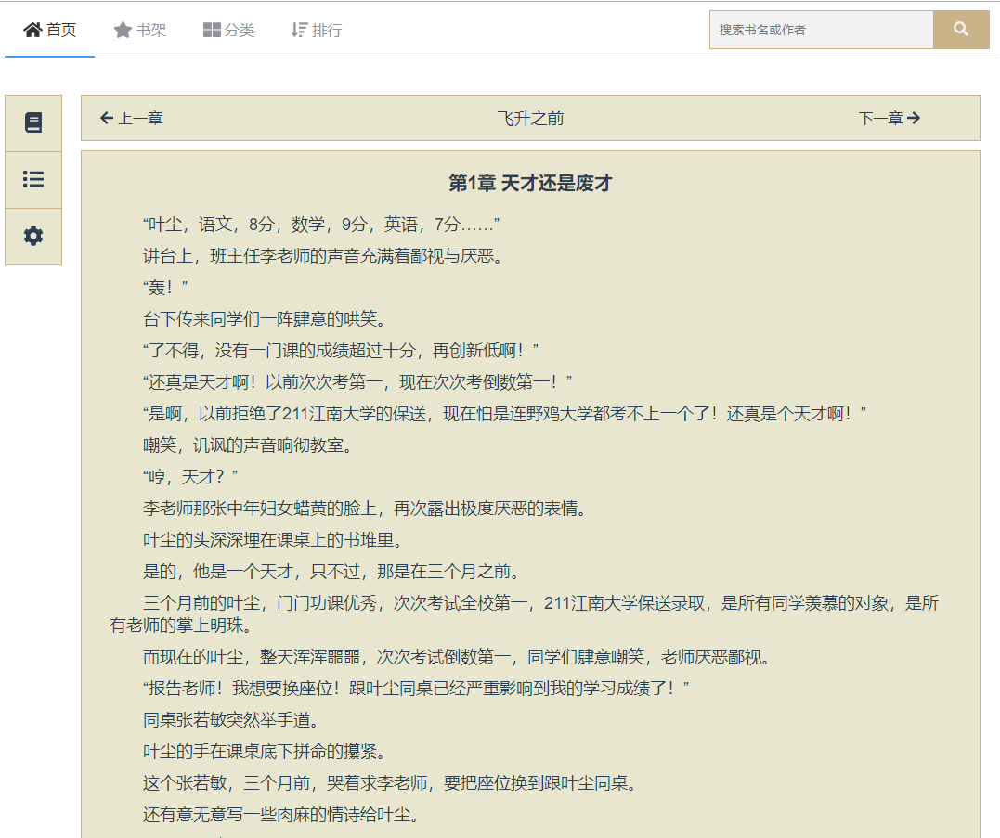

# 唯优小说

使用vue.js实现的纯前端小说阅读器，该项目主要用于学习前端技术。

### 网站截图

首页：


书籍详细页面：


阅读界面：



### 源码参考

源码参考自：<https://github.com/zgsnbtl/vue-guapi>

### 项目依赖

- stylus, stylus-loader: 用stylus语法写css
- element-ui: 饿了么出品的ui库 vue-novel

## Project setup

```
npm install
```

### Compiles and hot-reloads for development
```
npm run serve
```

### Compiles and minifies for production
```
npm run build
```

### Run your tests
```
npm run test
```

### Lints and fixes files
```
npm run lint
```

### Customize configuration
See [Configuration Reference](https://cli.vuejs.org/config/).

